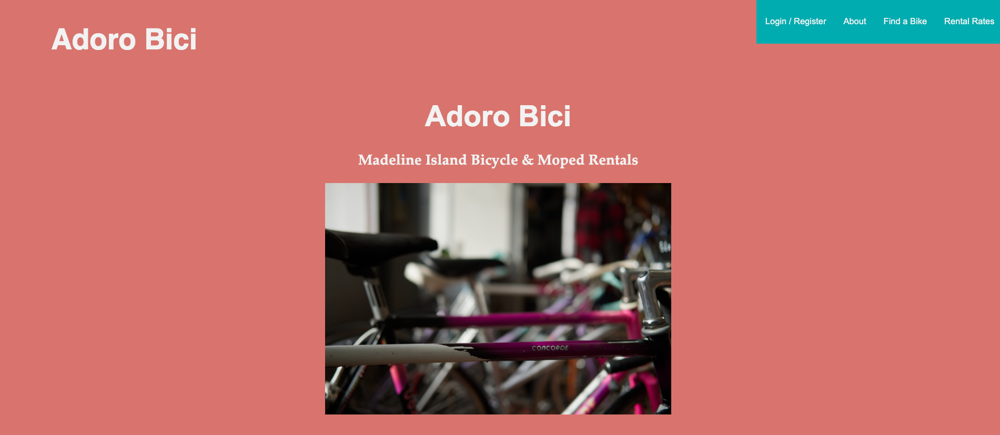
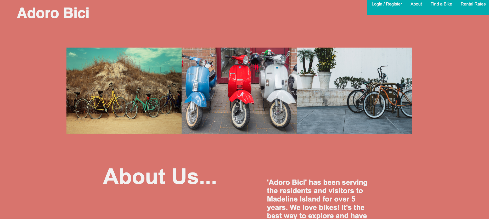
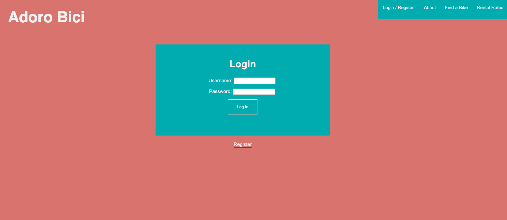
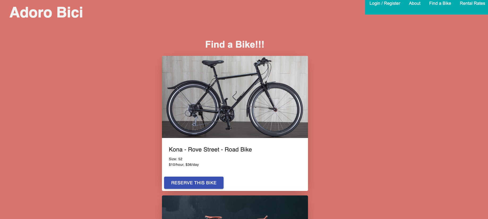
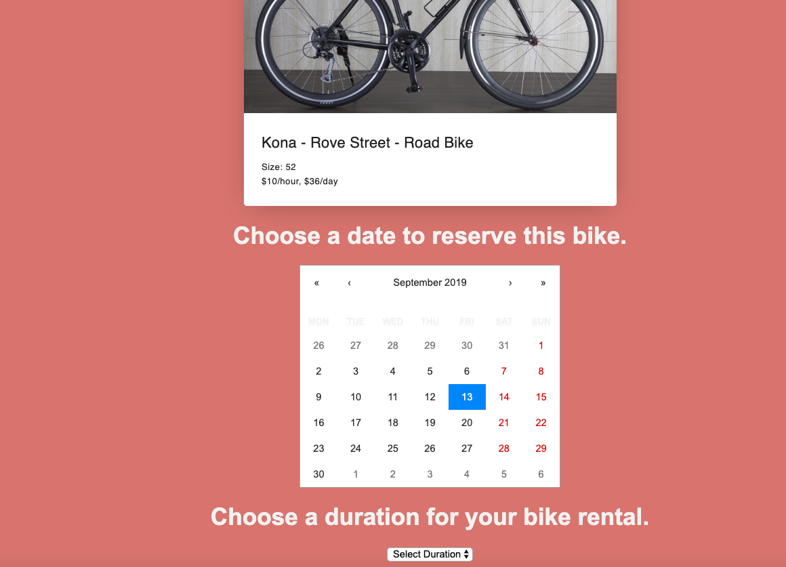
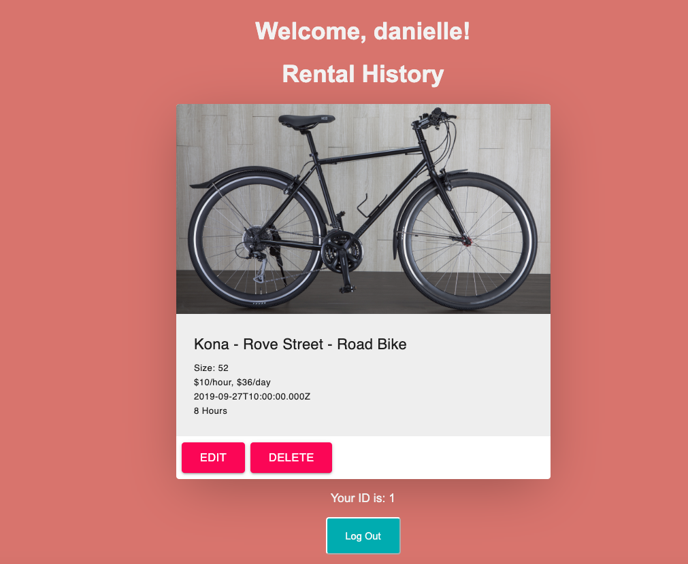

# Adoro Bici

‘Adoro Bici’ is a web application for a bike rental and souvenir shop located on Madeline Island. The app will enable the user to browse different bikes and mopeds that are available to rent. There will be a feature that will allow the user to reserve a bike for a specific date and time. The user will be able to edit their reservation or delete it completely. 

## Built With
-  React
-  Redux
-  React Saga
-  Express
-  Node.js
-  Postgresql
-  Materail UI
-  CSS

### Prerequisites

- [Node.js](https://nodejs.org/en/)
- [postgresSQL](https://www.postgresql.org)

### Installing

1. Download this project.
2. `npm install`
3. `npm start`

## Screen Shot

## Documentation

 - [Adoro-Bici-Solo-Scope](https://docs.google.com/document/d/12wG6RymcepGTmPMi_A9lkBSTSUr8TevLwKgzrXm1FbQ/edit?usp=sharing)

### Completed Features

- [x] User can browse bikes
- [x] User can reserve bikes for specific date and durataion
- [x] User can edit or delete reservation
- [x] Logeed in user can only see their own rental history
- [x] User must be logged in to reserve a bike

### Next Steps

Features that I would like to add at some point in the future.

- [ ] Admin Page where bikes can be added, edited, or deleted
- [ ] Shop Page where merchandise can shown and sold
- [ ] Implement API Stripe so reservations can be made by the user making a deposit

## Deployment

Coming Soon

## Authors

* Built By: Danielle Martain

## Acknowledgments

* Prime Digital Academy
* Playfair Cohort
